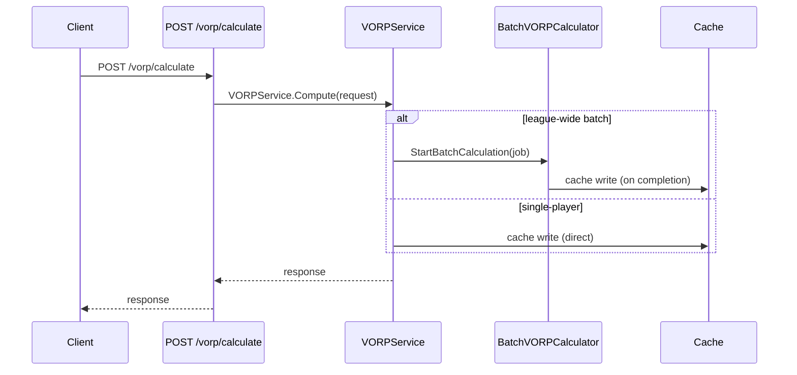

**Summary**: End-to-end VORP calculation pipeline — from data collection through replacement levels, base VORP, multipliers, storage, cache, and frontend display.
**Tags**: #research #vorp #flow #go
**Created**: 2026-04-11T00:00:00+00:00
**Last Updated**: 2026-04-29T00:00:00+00:00

---

## Content

VORP (Value Over Replacement Player) measures how much better a player is compared to a replacement-level player at their position. This note traces the complete calculation pipeline from trigger to display.

### Mermaid sequence diagram (swim-lane)



Note: the single-player path bypasses the batch calculator. The swim-lane is documented separately in the DIAGRAMS category.

### System diagram

```
┌─────────────┐     ┌────────────┐     ┌─────────────┐
│   Frontend  │────►│  API Layer │────►│   Backend   │
│  (React)    │◄────│  (Go HTTP) │◄────│  (Go Svc)   │
└─────────────┘     └────────────┘     └─────────────┘
                          │                   │
                          ▼                   ▼
                  ┌─────────────┐    ┌─────────────┐
                  │   Database  │    │    Cache    │
                  │ (SQLite/PG) │    │ (sync.Map)  │
                  └─────────────┘    └─────────────┘
```

### Tables involved

**Inputs**: `player_stats`, `player_projections`, `leagues`, `league_rules`, `league_vorp_settings`, `league_vorp_age_rules`.

**Outputs**: `vorp_calculations` (single table for both actual-stats and projection VORP, distinguished by `source_type` column).

### Phase 1 — Data collection

**Triggers**

- User clicks "Calculate VORP".
- Switching leagues triggers a background calculation.
- API: `GET /api/leagues/{leagueId}/players?season={seasonId}` and `POST /api/leagues/{leagueId}/vorp/recalculate`.

**Entry point**

```go
// server/internal/services/vorp.go
func (s *VORPService) CalculateLeagueVORP(leagueID string, seasonID uint)
```

It loads the league configuration (teams, roster sizes), scoring rules (points multipliers or category definitions), VORP settings (position scarcity, multi-position strategy), age rules, and all players with stats for the season.

### Phase 2 — Replacement level

**Method**: `roster_based`, `MinGamesPlayed: 1`.

**Points leagues** — For each position outlined in the league's position limits (C, W, LW, RW, F, D, U, LD, RD, G):

1. Get all players at the position.
2. Calculate fantasy points for each player.
3. Sort descending.
4. Find the replacement player at index `numTeams × MaxActive + reserveSlots`.
5. Store the replacement FP value.

**Category leagues** — For each position:

1. Calculate z-scores for each category (inverted for negative stats like GAA).
2. Multiply each z-score by the user-configured `rule.Weight` from `league_scoring_rules`, then sum.
3. Sort by z-score sum descending.
4. Find the replacement player using the same roster-based method.
5. Store the replacement z-score sum.

> **Weight semantics**: `rule.Weight = 0` means the category is **excluded** from this league's scoring — its contribution to the z-score sum is `z * 0 = 0`. The per-category z-score is still computed and stored in the `zScoreData` JSON for UI display. Do not substitute weight=0 with weight=1 anywhere in this pipeline — that band-aid silently inflates FPts by ~62% on real data and used to live at three sites in `vorp.go`.

### Phase 3 — Per-player VORP

**Base VORP**

```go
// Points
baseVORP = playerFP - replacementFP

// Category (z-scores are already weighted by user-configured category weights)
baseVORP = playerWeightedZScoreSum - replacementWeightedZScoreSum
```

For multi-position players, calculate VORP for each eligible position and **take the highest**.

**Position scarcity** — `getPositionMultiplier(position, settings)` reads scarcity values from `league_vorp_settings` (default 1.0 per position). Multi-position strategy is a user-configurable setting with validated options: `highest` (recommended default), `lowest`, or `average`.

**Age multipliers** — `getAgeMultiplier(age, ageRules)` reads from `league_vorp_age_rules`. Each rule has an operator (`<`, `>`, `<=`, `>=`, `=`, `!=`), an age, and a multiplier. Example: `Age < 25 → 1.2` (young players valued higher), `Age > 32 → 0.8` (older valued lower).

**Combined multiplier**

```go
positionIncrement = positionMultiplier - 1.0
ageIncrement      = ageMultiplier - 1.0
combinedMultiplier = 1.0 + positionIncrement + ageIncrement
finalVORP = baseVORP * combinedMultiplier

// Negative VORP inversion
if baseVORP < 0 {
    finalVORP = baseVORP + ((baseVORP * -1 * combinedMultiplier) + baseVORP)
}
```

**Worked examples**

```
Pos 1.5 → +0.5, Age 1.2 → +0.2, combined = 1.7, finalVORP = baseVORP * 1.7
Pos 1.1 → +0.1, Age 0.8 → -0.2, combined = 0.9, finalVORP = baseVORP * 0.9
```

### Phase 4 — Storage

Both the synchronous and batch paths write to `vorp_calculations` using an upsert pattern. The row is keyed by `(player_id, league_id, source_type, player_stat_id|player_projection_id)`:

```go
BEGIN
  -- Check if row exists
  SELECT id FROM vorp_calculations WHERE player_id=? AND league_id=? AND source_type=? AND deleted_at IS NULL
  -- Update if exists, insert if not
  UPDATE vorp_calculations SET fantasy_points=?, vorp=?, calculated_at=? WHERE id=?
  -- or
  INSERT INTO vorp_calculations (player_id, league_id, source_type, ...) VALUES (...)
COMMIT
```

**Cache** — `server/internal/services/vorp_cache.go`. Keys: `stats_{leagueID}_{seasonID}`, `replacement_{leagueID}_{seasonType}`, `vorp_{leagueID}_{seasonID}`. Invalidated on league switch, recalculation, or settings change.

### Phase 5 — Retrieval & display

**API** — `server/internal/api/handlers/stats_transformer.go`. When fetching players, the handler queries `vorp_calculations` for VORP and merges it into the player response.

**Frontend** — `app/components/features/players/PlayersTable.tsx`. Shows VORP in the player table with green/red color coding and supports sorting.

### Validation queries

```sql
-- VORP distribution by position (projection-sourced)
SELECT pp.position, AVG(vc.vorp) avg_vorp, MIN(vc.vorp) min_vorp, MAX(vc.vorp) max_vorp
FROM vorp_calculations vc
JOIN player_projections pp ON pp.id = vc.player_projection_id
WHERE vc.league_id = 'YOUR_LEAGUE_ID'
  AND vc.source_type = 'projection'
  AND vc.deleted_at IS NULL
GROUP BY pp.position;

-- Goalie VORP with high scarcity
SELECT pp.name, pp.position, vc.vorp
FROM vorp_calculations vc
JOIN player_projections pp ON pp.id = vc.player_projection_id
WHERE vc.league_id = 'YOUR_LEAGUE_ID'
  AND vc.source_type = 'projection'
  AND pp.position LIKE '%G%'
  AND vc.deleted_at IS NULL
ORDER BY vc.vorp DESC;
```

> **Note**: When querying `vorp_calculations` directly (not through GORM model methods), you MUST add `deleted_at IS NULL` manually. GORM's soft-delete filter only applies to model-based queries, not raw `Table()` calls.

## Related Notes

- [[VORP Implementation Architecture]]
- [[VORP Test Suite]]
- [[Auction System Overview]]
- [[Category Leagues Overview]]
