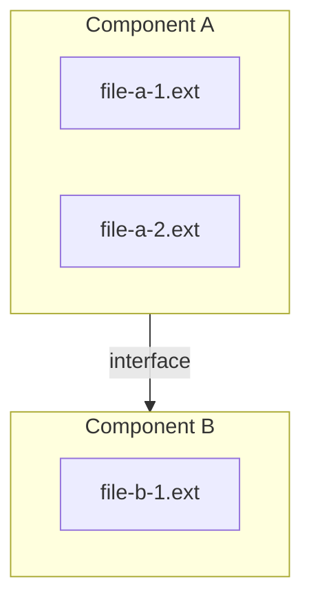

**Summary**: Module/component structure showing parts of the system, their responsibilities, and the interfaces between them.
**Tags**: #component #architecture #diagram
**Created**: 2026-04-06T00:00:00+00:00
**Last Updated**: 2026-04-06T00:00:00+00:00

---

## Content

### Diagram

Use `flowchart TB` with `subgraph` per component named after the real package/folder. Mermaid's `C4Container` renders but layout is poor — prefer styled `flowchart TB`.

### Components

| Component | Responsibility | Key file paths |
|---|---|---|
| Component A | one-sentence responsibility | `path/component-a/` |
| Component B | one-sentence responsibility | `path/component-b/` |

### Interfaces

| From | To | Contract / protocol |
|---|---|---|
| Component A | Component B | what flows across (function call, message, file, etc.) and the format |

### External dependencies

- ≤5 bullets naming runtime, libraries, services, or filesystem locations the components depend on.

## Related Notes

- [[Note Title]]
