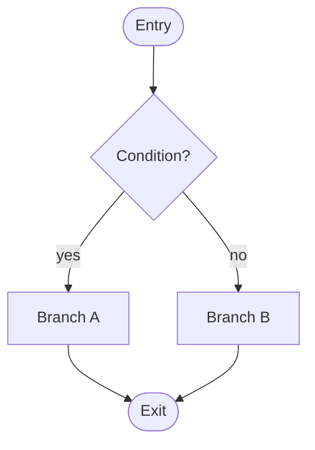

**Summary**: Decision/branch logic shown as a flowchart with code mapping and edge-case behavior.
**Tags**: #flowchart #decision #diagram
**Created**: 2026-04-06T00:00:00+00:00
**Last Updated**: 2026-04-06T00:00:00+00:00

---

## Content

### Diagram

### Decision narrative

For each branch, one sentence describing what code path it represents and when the predicate fires.

- **Branch A** — when …
- **Branch B** — when …

### Code mapping

- File: `path/to/dispatcher.ext`
- Entry symbol: `function_or_match_block`
- Each diamond in the diagram corresponds to a `match`/`switch`/`if` predicate in the source.

### Edge cases / fallthrough

- Default branch behavior when no predicate matches.
- Behavior on malformed input.
- Behavior on the predicates being evaluated in a different order (if order matters, say so).

## Related Notes

- [[Note Title]]
