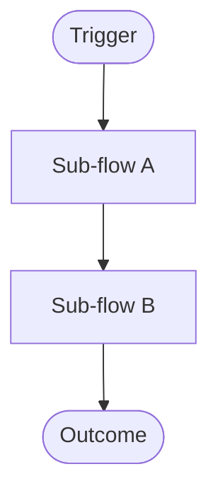

**Summary**: High-level orchestration flow whose nodes link to detailed sequence-flow notes for each named sub-flow.
**Tags**: #interaction #overview #diagram
**Created**: 2026-04-06T00:00:00+00:00
**Last Updated**: 2026-04-06T00:00:00+00:00

---

## Content

### Diagram

Each node corresponds to a named sub-flow that has its own `sequence-flow.md` note in `DIAGRAMS/`. Use Mermaid `click` directives to wire nodes to the child notes; readers and the recall agent can follow them.

### Sub-flow index

| Node | Detail note | What this sub-flow does |
|---|---|---|
| Sub-flow A | [[sub-flow-a|Sub-flow A title]] | one-sentence description |
| Sub-flow B | [[sub-flow-b|Sub-flow B title]] | one-sentence description |

### Composition narrative

One paragraph: how the sub-flows compose into the overall interaction. Name the trigger, the order, and what determines completion vs. failure.

## Related Notes

- [[note-basename|Display Title]]
