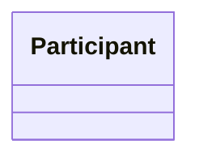

**Summary**: Recurring code pattern with intent, structure, sample, and an explicit anti-pattern callout.
**Tags**: #pattern #architecture
**Created**: 2026-04-06T00:00:00+00:00
**Last Updated**: 2026-04-06T00:00:00+00:00

---

## Content

### Intent

One sentence: what problem does this pattern solve, and what shape does the solution take?

### When to use / when NOT to use

- **Use when**: situations that justify the pattern.
- **Do NOT use when**: situations that look similar but warrant a different solution.

### Structure

Optional Mermaid `classDiagram` block, or a short code skeleton showing the participants and their relationships.



### Sample (from this codebase)

≤30 lines from a real file. Cite the path.

```text
file: path/to/real/file.ext (lines N–M)
```

### Known uses

At least two file paths in this repo where this pattern lives:

- `path/to/example-1.ext`
- `path/to/example-2.ext`

### Anti-pattern callout

**Looks like this pattern but isn't:** describe the near-miss shape, why it superficially resembles the pattern, and what makes it wrong (different invariants, different failure mode, different scope).

## Related Notes

- [[Note Title]]
