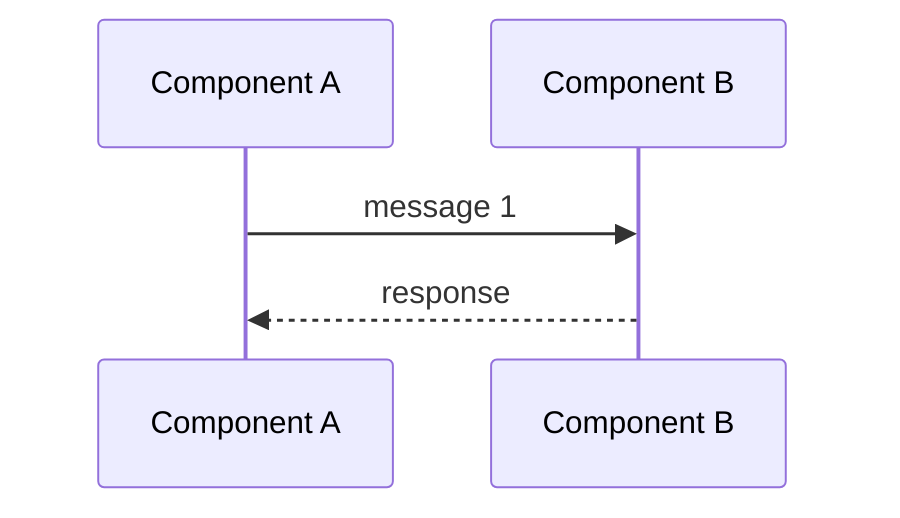

**Summary**: Time-ordered cross-component message flow with numbered narrative and failure modes.
**Tags**: #sequence #flow #diagram
**Created**: 2026-04-06T00:00:00+00:00
**Last Updated**: 2026-04-06T00:00:00+00:00

---

## Content

### Diagram

### Numbered narrative

1. One sentence per step. The narrative names what happened, not how it was implemented.
2. …
3. …

### Files involved

| Component | File | Role |
|---|---|---|
| Component A | `path/to/a.ext` | initiates the flow |
| Component B | `path/to/b.ext` | handles the message |

### Failure modes

- ≤3 bullets describing what breaks the flow and what each failure looks like to upstream callers.

## Related Notes

- [[Note Title]]
