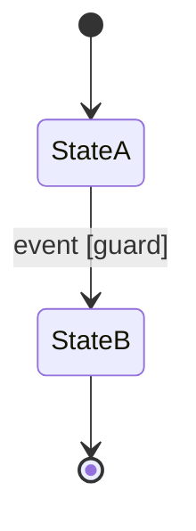

**Summary**: Finite-state machine for an entity, with states, transitions, invariants, and a code-mapping pointer.
**Tags**: #state-machine #diagram
**Created**: 2026-04-06T00:00:00+00:00
**Last Updated**: 2026-04-06T00:00:00+00:00

---

## Content

### Diagram

### States

| State | Description | Entry actions | Exit actions |
|---|---|---|---|
| `StateA` | What this state represents | none | none |
| `StateB` | What this state represents | none | none |

### Transitions

| From | Event | To | Guard | Effect |
|---|---|---|---|---|
| `StateA` | `event` | `StateB` | optional | side effect |

### Invariants

- 1–3 bullets describing what must always be true regardless of state.

### Code mapping

- File: `path/to/dispatcher.ext`
- Symbol: `function_or_class_name`
- Each row in the Transitions table maps 1:1 to a branch in the dispatcher.

## Related Notes

- [[Note Title]]
